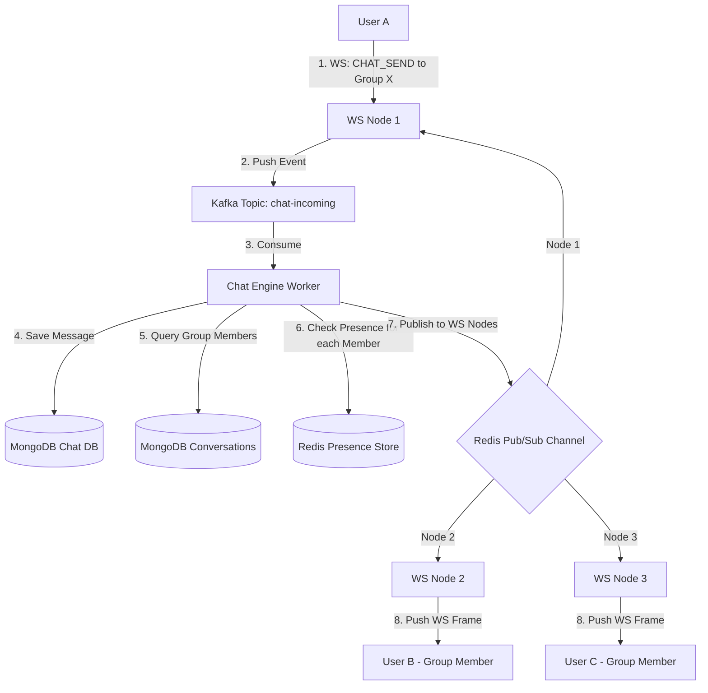
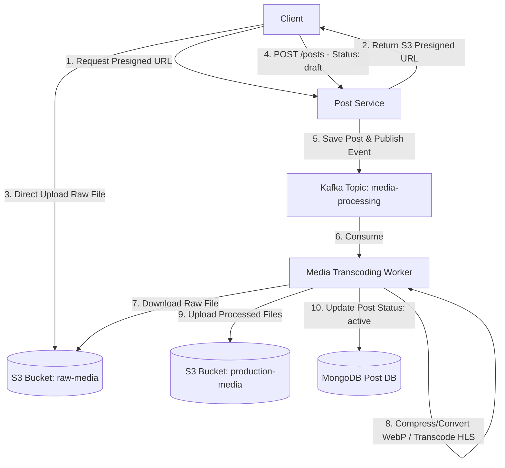

# Tài liệu Thiết kế các Tính năng Nâng cao (Advanced Features Design)

Tài liệu này đặc tả thiết kế chi tiết cho các tính năng nâng cao được đề xuất để nâng cấp hệ thống mạng xã hội (social-network-system) lên quy mô lớn (production-ready). Các giải pháp tập trung vào tối ưu hóa hiệu năng, giảm tải cho cơ sở dữ liệu, đảm bảo tính thời gian thực (real-time) và khả năng giám sát hệ thống.

---

## 1. Chat Nhóm (Group Chat)

Để hỗ trợ chat nhiều người, chúng ta cần chuyển đổi từ mô hình chat 1-1 thuần túy sang mô hình hội thoại (Conversations) trừu tượng.

### 1.1 Thiết kế Cơ sở dữ liệu (MongoDB)
*   **Collection**: `conversations`
```json
{
  "_id": "ObjectID",
  "type": "string (GROUP / DIRECT)",
  "name": "string (chỉ dùng cho GROUP)",
  "avatar_url": "string (nullable)",
  "creator_id": "ObjectID",
  "members": [
    {
      "user_id": "ObjectID",
      "role": "string (ADMIN / MEMBER)",
      "joined_at": "ISODate"
    }
  ],
  "last_message": {
    "msg_id": "ObjectID",
    "sender_id": "ObjectID",
    "content": "string",
    "created_at": "ISODate"
  },
  "created_at": "ISODate",
  "updated_at": "ISODate"
}
```

### 1.2 Luồng Phân phối Tin nhắn Nhóm (Fan-out Message)



*   **Tối ưu hóa Presence cho Nhóm lớn**: Với nhóm chat có hàng nghìn thành viên, việc tra cứu từng thành viên trong Redis có thể tốn kém. Giải pháp là lưu danh sách các WebSocket Node đang có ít nhất 1 thành viên của nhóm đang online (Node-level subscription). Thay vì gửi tới từng cá nhân, Chat Engine chỉ cần publish tin nhắn tới channel của các WS Node đó.

---

## 2. Xử lý Media bất đồng bộ (Image/Video Transcoding Worker)

Việc bắt người dùng đợi upload ảnh dung lượng lớn hoặc video gốc trực tiếp sẽ làm giảm trải nghiệm người dùng nghiêm trọng. Thiết kế tối ưu hóa luồng tải lên và xử lý media:

### 2.1 Kiến trúc Xử lý Bất đồng bộ



*   **Tính năng bổ sung**: Trực quan hóa tiến trình xử lý media cho người dùng qua WebSocket Node bằng cách gửi các frame cập nhật tiến độ (ví dụ: `MEDIA_PROCESSING_PROGRESS: 50%`).

---

## 3. Distributed Tracing (Theo dõi phân tán) với OpenTelemetry

Tích hợp OpenTelemetry (OTel) SDK vào tất cả các microservices để theo dõi toàn bộ vòng đời của một request qua nhiều service khác nhau:

*   **Cơ chế truyền Context (Context Propagation):**
    *   *HTTP Calls:* Inject `traceparent` (W3C Trace Context) vào HTTP Headers.
    *   *Kafka Messages:* Inject trace context vào Kafka Message Headers.
    *   *gRPC Calls:* Sử dụng metadata.
*   **Visualization:** Toàn bộ dữ liệu trace được xuất ra Collector và hiển thị trực quan trên **Jaeger** hoặc **Grafana Tempo**. Từ đó có thể phát hiện nghẽn cổ chai (bottleneck) ở service nào hay truy vấn DB nào chậm.
