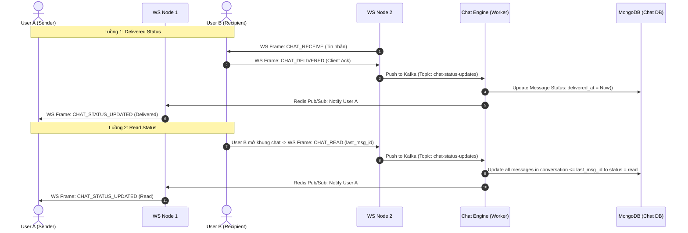
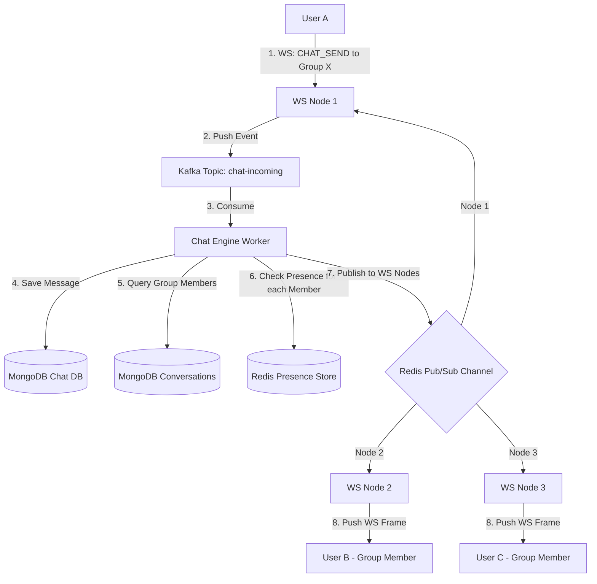
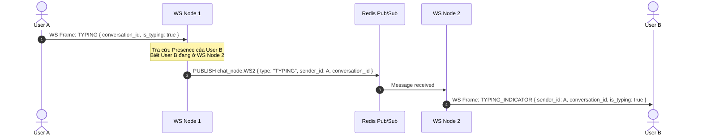
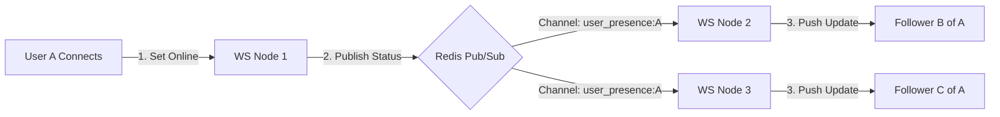
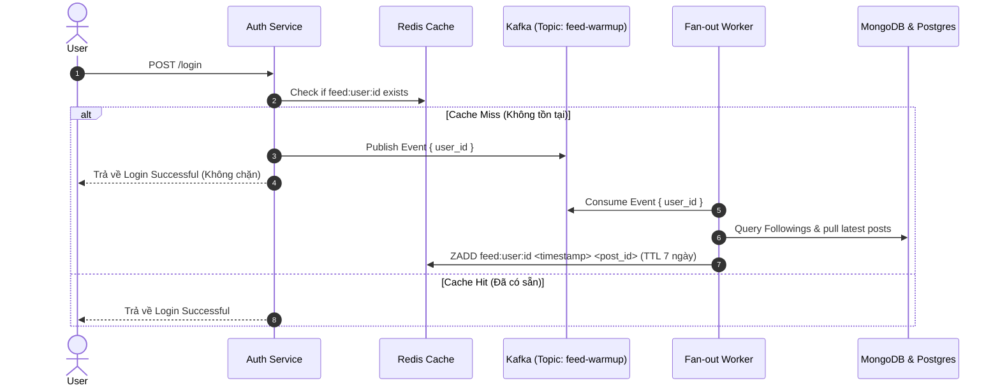
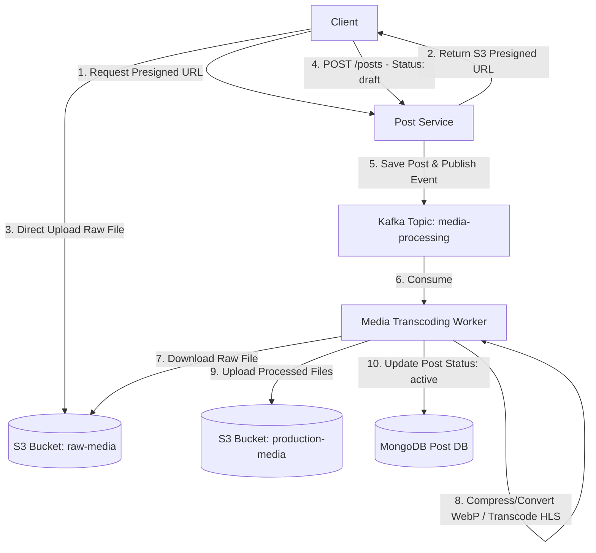
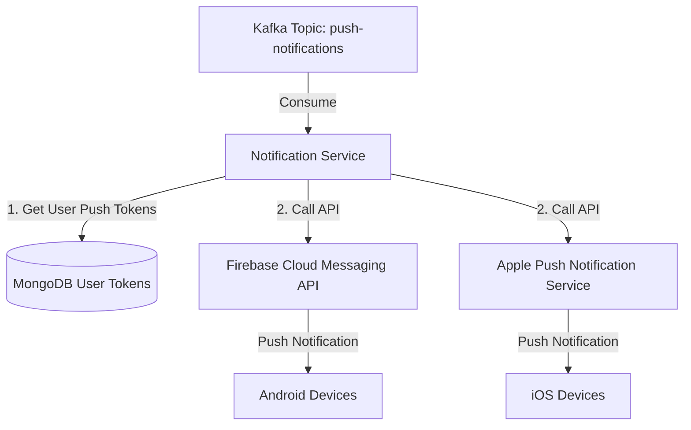

# Tài liệu Thiết kế các Tính năng Nâng cao (Advanced Features Design)

Tài liệu này đặc tả thiết kế chi tiết cho các tính năng nâng cao được đề xuất để nâng cấp hệ thống mạng xã hội (social-network-system) lên quy mô lớn (production-ready). Các giải pháp tập trung vào tối ưu hóa hiệu năng, giảm tải cho cơ sở dữ liệu, đảm bảo tính thời gian thực (real-time) và khả năng giám sát hệ thống.

---

## 1. Trạng thái tin nhắn Real-time (Message Delivery & Read Status)

Hiện tại, hệ thống mới chỉ phản hồi `CHAT_ACK` để xác nhận tin nhắn đã tới WebSocket Node. Để hiển thị trạng thái đã nhận (delivered) và đã đọc (read) như các ứng dụng chat hiện đại, chúng ta thiết kế cơ chế sau:

### 1.1 Luồng Dữ liệu Trạng thái (Data Flows)



### 1.2 Thiết kế Schema MongoDB cập nhật
Mỗi tin nhắn sẽ cần bổ sung các trường thời gian để ghi nhận trạng thái:

```json
{
  "_id": "ObjectID",
  "conversation_id": "string",
  "sender_id": "ObjectID",
  "recipient_id": "ObjectID",
  "content_type": "string",
  "content": "string",
  "created_at": "ISODate",
  "delivered_at": "ISODate (nullable)",
  "read_at": "ISODate (nullable)"
}
```

*   **Chỉ mục (Indexes) bổ sung**:
    *   `{ "conversation_id": 1, "read_at": 1 }` để nhanh chóng truy vấn những tin nhắn chưa đọc và cập nhật trạng thái đọc hàng loạt.

---

## 2. Chat Nhóm (Group Chat)

Để hỗ trợ chat nhiều người, chúng ta cần chuyển đổi từ mô hình chat 1-1 thuần túy sang mô hình hội thoại (Conversations) trừu tượng.

### 2.1 Thiết kế Cơ sở dữ liệu (MongoDB)
*   **Collection**: `conversations`
```json
{
  "_id": "ObjectID",
  "type": "string (GROUP / DIRECT)",
  "name": "string (chỉ dùng cho GROUP)",
  "avatar_url": "string (nullable)",
  "creator_id": "ObjectID",
  "members": [
    {
      "user_id": "ObjectID",
      "role": "string (ADMIN / MEMBER)",
      "joined_at": "ISODate"
    }
  ],
  "last_message": {
    "msg_id": "ObjectID",
    "sender_id": "ObjectID",
    "content": "string",
    "created_at": "ISODate"
  },
  "created_at": "ISODate",
  "updated_at": "ISODate"
}
```

### 2.2 Luồng Phân phối Tin nhắn Nhóm (Fan-out Message)



*   **Tối ưu hóa Presence cho Nhóm lớn**: Với nhóm chat có hàng nghìn thành viên, việc tra cứu từng thành viên trong Redis có thể tốn kém. Giải pháp là lưu danh sách các WebSocket Node đang có ít nhất 1 thành viên của nhóm đang online (Node-level subscription). Thay vì gửi tới từng cá nhân, Chat Engine chỉ cần publish tin nhắn tới channel của các WS Node đó.

---

## 3. Trạng thái "Đang gõ..." (Typing Indicator)

Đây là tính năng real-time thuần túy, không cần lưu trữ vĩnh viễn (persistent). Do đó, chúng ta sẽ thiết kế một luồng **bất tuần tự (bypass)** hoàn toàn qua Database và Kafka để giảm thiểu độ trễ tối đa.



*   **Cơ chế chống nhiễu (Debouncing):** Client chỉ gửi gói tin `TYPING` 1 lần mỗi 3 giây khi người dùng liên tục gõ phím. Nếu sau 5 giây không nhận được gói tin `TYPING` tiếp theo, client của người nhận sẽ tự động ẩn trạng thái đang gõ.

---

## 4. Danh sách Bạn bè Online (Presence List Real-time)

Để hiển thị danh sách người dùng đang hoạt động (Online/Offline status) cho bạn bè/follower của họ.

### 4.1 Cơ chế Đăng ký Sự kiện Presence (Presence Subscription)
Khi Client kết nối tới WebSocket Node:
1.  Hệ thống truy vấn Postgres lấy danh sách những người mà User đó đang follow (Following list).
2.  WS Node đăng ký (subscribe) vào Redis Pub/Sub channels của tất cả những người trong Following list đó: `user_presence:<target_user_id>`.
3.  Khi bất kỳ người nào trong danh sách online/offline, sự kiện thay đổi trạng thái sẽ được push trực tiếp tới WS Node để cập nhật UI của client.

### 4.2 Luồng lan truyền trạng thái (Presence Fan-out)



---

## 5. Active Cache Warm-up (Khởi động lại Cache Feed)

Redis Feed Cache lưu trữ feed dưới dạng Sorted Set (`ZSET`) với TTL là 7 ngày. Đối với người dùng ít hoạt động, cache của họ sẽ bị xoá để tiết kiệm RAM. Khi họ đăng nhập trở lại, việc truy vấn MongoDB để build lại cache có thể gây lag.

### 5.1 Giải pháp Active Warm-up qua Kafka



---

## 6. Xử lý Media bất đồng bộ (Image/Video Transcoding Worker)

Việc bắt người dùng đợi upload ảnh dung lượng lớn hoặc video gốc trực tiếp sẽ làm giảm trải nghiệm người dùng nghiêm trọng. Thiết kế tối ưu hóa luồng tải lên và xử lý media:

### 6.1 Kiến trúc Xử lý Bất đồng bộ



*   **Tính năng bổ sung**: Trực quan hóa tiến trình xử lý media cho người dùng qua WebSocket Node bằng cách gửi các frame cập nhật tiến độ (ví dụ: `MEDIA_PROCESSING_PROGRESS: 50%`).

---

## 7. Hệ thống Push Notification thực tế (FCM & APNs)

Xây dựng microservice **Notification Service** chịu trách nhiệm gửi thông báo đẩy thực tế lên thiết bị của người dùng qua Firebase Cloud Messaging (FCM) và Apple Push Notification Service (APNs).

### 7.1 Kiến trúc Notification Service



*   **Quản lý Token:** Cung cấp API `/api/v1/notifications/tokens` cho Client để đăng ký và cập nhật FCM/APNs token của thiết bị mỗi khi người dùng cài đặt lại app hoặc đăng nhập trên thiết bị mới.

---

## 8. Giám sát & Giới hạn Tần suất (Observability & Rate Limiting)

### 8.1 Distributed Tracing (Theo dõi phân tán) với OpenTelemetry
Tích hợp OpenTelemetry (OTel) SDK vào tất cả các microservices để theo dõi toàn bộ vòng đời của một request qua nhiều service khác nhau:

*   **Cơ chế truyền Context (Context Propagation):**
    *   *HTTP Calls:* Inject `traceparent` (W3C Trace Context) vào HTTP Headers.
    *   *Kafka Messages:* Inject trace context vào Kafka Message Headers.
    *   *gRPC Calls:* Sử dụng metadata.
*   **Visualization:** Toàn bộ dữ liệu trace được xuất ra Collector và hiển thị trực quan trên **Jaeger** hoặc **Grafana Tempo**. Từ đó có thể phát hiện nghẽn cổ chai (bottleneck) ở service nào hay truy vấn DB nào chậm.

### 8.2 Sliding Window Rate Limiting bằng Redis
Áp dụng thuật toán Sliding Window Counter sử dụng Redis Sorted Set (ZSET) tại API Gateway để ngăn chặn tấn công DDoS, Spam API:

*   **Cơ chế hoạt động:**
    1.  Mỗi request gửi đến sẽ tương ứng với một phần tử trong ZSET với value và score là timestamp hiện tại.
    2.  Dùng lệnh `ZREMRANGEBYSCORE key 0 (now - window_size)` để xoá các request nằm ngoài cửa sổ thời gian (ví dụ: ngoài 1 phút vừa qua).
    3.  Dùng `ZCARD key` để đếm số request còn lại trong cửa sổ. Nếu vượt quá giới hạn, trả về mã lỗi `429 Too Many Requests`.
    4.  Cập nhật TTL cho key bằng window size.
